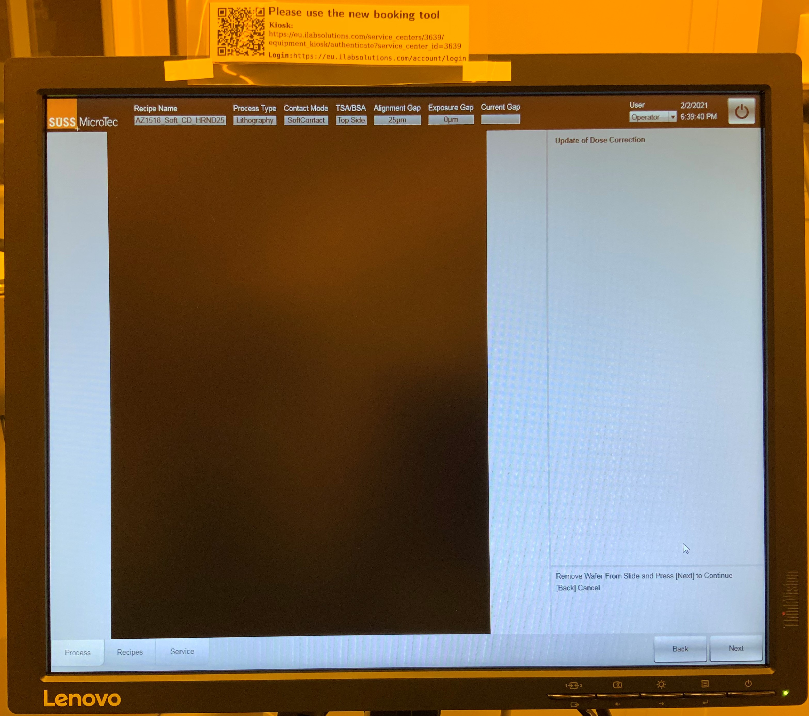

# MicroTec Süss MA/BA Gen4 Mask Aligner

#### Toby Bi

##### 2021.03.15

Steps to use the MicroTec Süss MA/BA Gen4 mask aligner in the nanofabrication cleanroom at MPL.

https://www.suss.com/en/products-solutions/mask-aligner/ma-ba-gen4-series

Follow the prompts on the bottom right corner for hints

1. Switch on UV light source by turning clockwise, wait 30s.

2. Switch on Machine by turning clockwise.

3. Open mask aligner software on computer.

4. **Initialize.**

5. Select **Process** on the left based on photoresist used, exposure intensity, exposure dose, and exposure gap type.

   - Ensure all the indicator LEDs are green on the start page.

6. **Change Tools.**

   

7. Select correct **Mounted Tool Set** to match **Recipe Tool Set**.

   - Tool Set S-8-10-20-25 for microdisks.

8. **Unclamp Mask Holder** and remove from the machine.

   - Careful of the mask holder vacuum line.

   - If the mask holder or tool set is not the desired, remove the vacuum line and replace with mask holder from large cupboard by the door.

   - The chuck on top of the slide will most likely also need to change. The chuck sits without connections on the slide and replacements can be found in the same large cupboard shelf as the mask holder.

     

9. Place the mask holder on rubberised platform to the left of exposure region.

   

10. Align photomask and pattern over exposure area.

    - Ensure the chromium side is facing towards the ceiling.

    

11. **Select Mask Vacuum** to ensure photomask does not move.

12. Mount mask holder back into the machine.

13. **Clamp Mask Holder.**

14. **Next** to return to start page.

15. On the start page select **Start Process**.

16. [Optional] If this is the first time the mask aligner has been used, a dose correction exposure will occur. Ensure that there are no samples in the slide as they will get exposed. Select **Next** once the dose correction is complete.

    

17. You will be prompted to load the wafer onto the slide. Open the slide and place the wafer in the centre of the chuck.

18. Press **Next** to switch on the wafer transport vacuum. This keeps the wafer stationary on the chuck while the slide is inserted back into the machine.

19. Once inserted, the manual pattern alignment menu will appear. Align the pattern using the joystick onto the sample.

    - The right button on the joystick toggles between Stage XY$$\theta$$ and Camera XY/Focus.

    - The left button on the joystick toggles between single step, 1%, 10%, 50%, and 100% speed.

      

20. Select **Expose**.

    

21. Once the exposure is complete, pull the slide out to remove the sample and follow **Steps 6-13** in reverse order to remove the photomask.

## ADVANCED: Changing Process and Recipe parameters

1. In the top right corner **User** drop down menu select **Application**.
2. Input password.
3. Select **Recipes** on the bottom left corner.
4. Edit the exposure intensity (maximum and half at the moment), exposure dose and exposure gap distance.
5. Save and name your new recipe according to the photoresist used and other parameters.

